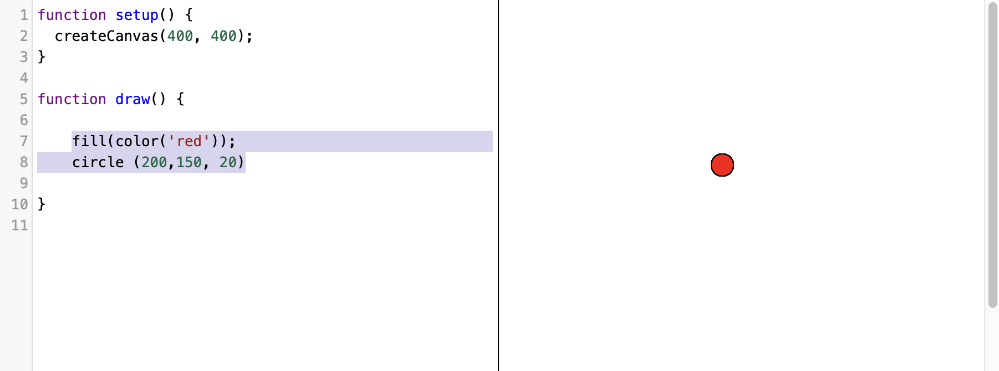

## Aufgabe
Zeichne weitere Kreise, dazu kannst du die X und Y Koordinate, den Radius oder die Farbe ändern.
Füge diesen Code teil in die draw() Funktion ein. Die 3 Variablen in der Klammer bei circle stehen für die X-, Y-Koordinate und den Radius.

```
fill(color('red'));
circle (200, 150, 20);
```

