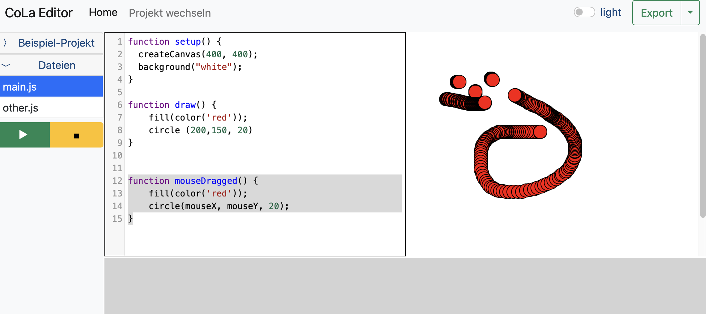

## Zeichnen
Nun fügen wir noch eine weitere Funktion hinzu, damit du dein künstlerische Seite zeigen kannst...

```
function mouseDragged) {
    fill(color('red'));
    circle (mouseX, mouseY, 20);
}
```


	